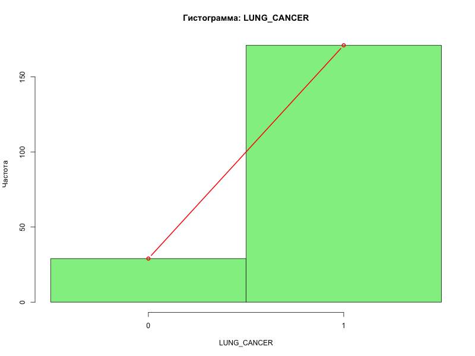
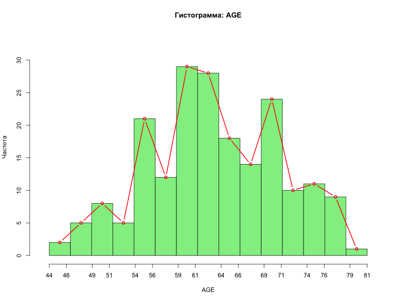
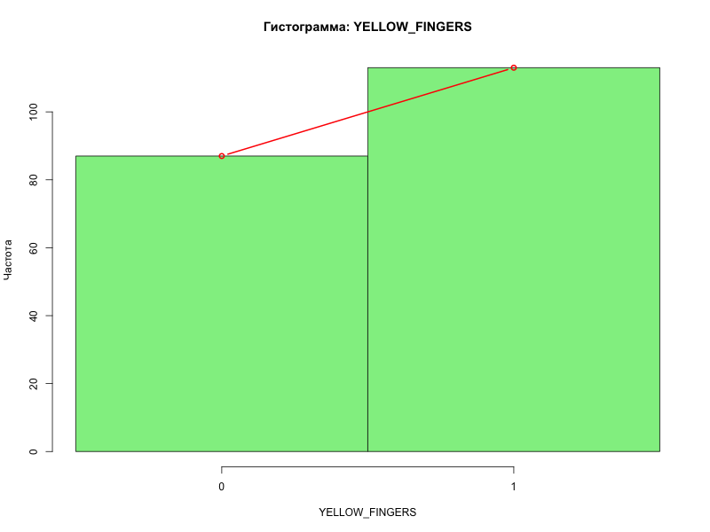
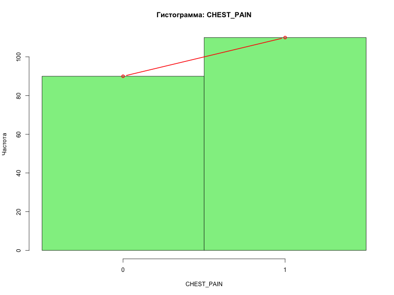
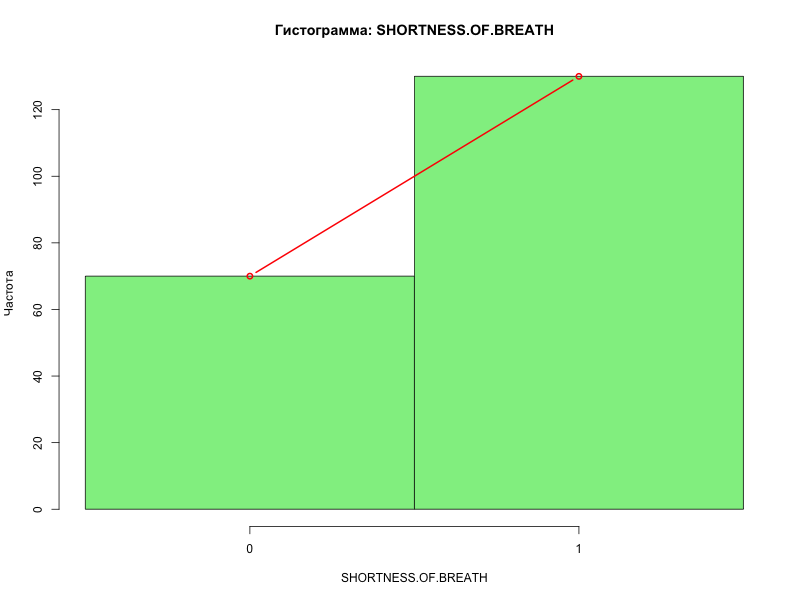

# Лабораторная работа №1 — Первичный статистический анализ данных

## Введение

**Цель работы:** выполнить первичный анализ данных датасета `survey lung cancer.csv`, рассчитать основные описательные статистики (среднее, медиана, мода, дисперсия, СКО) для целевого признака и влияющих факторов вручную (без использования встроенных функций `mean()`, `sd()` и т.п.), а также визуализировать распределения с помощью гистограмм и полигонов частот.

**Исходные данные:** 200 наблюдений (случайная выборка из 309 строк полного датасета `entry.csv`), 16 признаков. Целевой признак — `LUNG_CANCER` (наличие рака лёгких, перекодирован в 0/1). Влияющие признаки: `AGE`, `SMOKING`, `YELLOW_FINGERS`, `CHEST_PAIN`, `SHORTNESS.OF.BREATH`. Бинарные признаки со значениями {1, 2} перекодированы в {0, 1}.

**Обработка выбросов:** для признака `AGE` проведено удаление выбросов по правилу 1.5×IQR (удалено 3 наблюдения, осталось 197). Для бинарных признаков выбросы не удалялись в силу их природы.

## Таблица описательных статистик

| Признак | Среднее | Медиана | Мода | СКО | Дисперсия |
|---|---|---|---|---|---|
| LUNG_CANCER | 0.855 | 1 | 1 | 0.353 | 0.125 |
| AGE | 63.117 | 63 | 62 | 7.688 | 59.104 |
| SMOKING | 0.555 | 1 | 1 | 0.498 | 0.248 |
| YELLOW_FINGERS | 0.565 | 1 | 1 | 0.497 | 0.247 |
| CHEST_PAIN | 0.550 | 1 | 1 | 0.499 | 0.249 |
| SHORTNESS.OF.BREATH | 0.650 | 1 | 1 | 0.478 | 0.229 |

*Примечание:* все метрики рассчитаны вручную по формулам: выборочное среднее $\bar{x} = \frac{1}{n}\sum x_i$, несмещённая дисперсия $s^2 = \frac{1}{n-1}\sum(x_i - \bar{x})^2$, медиана — значение на середине упорядоченного ряда, мода — наиболее часто встречающееся значение.

## Гистограммы и полигоны частот

### LUNG_CANCER

### AGE

### SMOKING

### YELLOW_FINGERS

### CHEST_PAIN

### SHORTNESS_OF_BREATH

## Выводы

1. **Доля больных в выборке:** среднее `LUNG_CANCER = 0.855` означает, что 85.5% респондентов имеют диагностированный рак лёгких. Это существенное смещение (дисбаланс классов), которое необходимо учитывать при дальнейшем моделировании.

2. **Возраст:** после удаления 3 выбросов средний возраст составил 63.1 года, медиана — 63 года, мода — 62 года, что указывает на симметричность распределения. Основная масса респондентов (после фильтрации) приходится на возраст 55–70 лет.

3. **Факторы риска:** медиана и мода всех бинарных признаков (SMOKING, YELLOW_FINGERS, CHEST_PAIN, SHORTNESS.OF.BREATH) равны 1, что говорит о преобладании положительных ответов в выборке. Наибольшая частота встречаемости — у `SHORTNESS_OF_BREATH` (0.650), наименьшая — у `CHEST_PAIN` (0.550).

4. **Вариативность:** СКО возраста (7.69) после удаления выбросов уменьшилось, что указывает на более однородную группу. Для бинарных признаков СКО находится в диапазоне 0.48–0.50, что характерно для распределений с долей ~0.5 (максимальная неопределённость).
