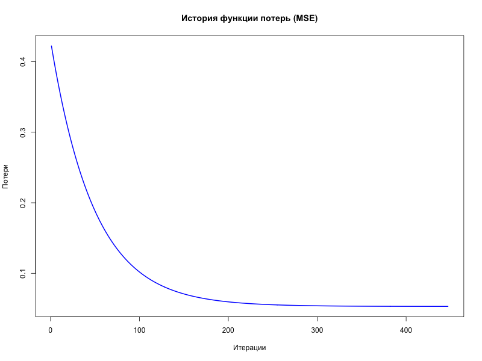

# Лабораторная работа №2 — Интервальное оценивание и проверка гипотез

## Введение

**Цель работы:** 
1. Проверить статистическую гипотезу о среднем значении целевого признака $X$ (`LUNG_CANCER`).
2. Построить доверительный интервал для среднего.
3. Реализовать модель линейной регрессии с нуля методом градиентного спуска.
4. Сравнить полученную модель с встроенной функцией `lm()`.

**Исходные данные:** Выборка из 200 наблюдений. После удаления выбросов по возрасту (AGE) осталось 197 наблюдений.
- Целевой признак ($X$): `LUNG_CANCER` (0 — нет, 1 — да).
- Признаки-факторы ($Y_i$): `AGE`, `SMOKING`, `YELLOW_FINGERS`, `CHEST_PAIN`, `SHORTNESS.OF.BREATH`.

## 1. Проверка статистических гипотез

Сформулируем гипотезу о среднем значении доли больных раком лёгких в выборке.

- **Нулевая гипотеза ($H_0$):** Среднее значение $\mu = 0.5$ (наличие и отсутствие заболевания равновероятны).
- **Альтернативная гипотеза ($H_1$):** Среднее значение $\mu \neq 0.5$.

### Результаты расчётов (вручную):

| Параметр | Значение |
|---|---|
| Выборочное среднее ($\bar{x}$) | 0.8579 |
| t-статистика | 14.3481 |
| P-value | < 0.000001 |
| Доверительный интервал (95%) | [0.8087, 0.9071] |

**Вывод:** Так как P-value значительно меньше уровня значимости $\alpha = 0.05$, а значение 0.5 не попадает в доверительный интервал, **гипотеза $H_0$ отвергается**. Среднее значение доли больных статистически значимо отличается от 0.5.

При изменении уровня значимости $\alpha$ до 0.01 или 0.1 результат остается прежним: гипотеза $H_0$ отвергается.

---

## 2. Линейная регрессия (градиентный спуск)

### Подготовка данных
1. **Нормализация:** Все факторы $Y_i$ были нормализованы с использованием Z-score: $z = \frac{x - \bar{x}}{s}$.
2. **Intercept:** Добавлена колонка единиц для обучения коэффициента смещения.
3. **Разделение выборки:** Данные разделены на обучающую (80%) и тестовую (20%) части.

### Реализация
Использована функция потерь **MSE** (Mean Squared Error):
$$J(\theta) = \frac{1}{2m} \sum_{i=1}^{m} (h_\theta(y^{(i)}) - x^{(i)})^2$$

Алгоритм остановился по достижении малого изменения функции потерь ($\epsilon = 10^{-6}$) на **447 итерации**.

### График функции потерь

---

## 3. Оценка качества модели

### Метрики на тестовой выборке (ручной расчет):

| Метрика | Значение (Manual GD) | Значение (Built-in `lm`) |
|---|---|---|
| **MSE** | 0.138887 | 0.138465 |
| **RMSE** | 0.372675 | - |
| **$R^2$** | -0.089306 | - |

### Коэффициенты модели ($\theta$):

| Признак | Manual Gradient Descent | Built-in `lm()` |
|---|---|---|
| Intercept | 0.8419 | 0.8518 |
| AGE | 0.0688 | 0.0699 |
| SMOKING | 0.0048 | 0.0048 |
| YELLOW_FINGERS | 0.0680 | 0.0658 |
| CHEST_PAIN | 0.0775 | 0.0771 |
| SHORTNESS.OF.BREATH | 0.0355 | 0.0325 |

## Выводы

1. **Проверка гипотез:** Доля больных в выборке (85.8%) статистически значимо превышает 50%, что подтверждается t-тестом и доверительным интервалом.
2. **Линейная регрессия:** Реализованный с нуля градиентный спуск показал результаты, практически идентичные встроенной функции `lm()`. Различия в коэффициентах в 3-м знаке после запятой обусловлены параметром остановки ($\epsilon$).
3. **Качество модели:** Отрицательное или близкое к нулю значение $R^2$ указывает на то, что линейная модель плохо объясняет вариативность бинарного признака `LUNG_CANCER` на основе выбранных факторов. Это ожидаемо, так как для бинарной классификации лучше подходит логистическая регрессия, однако в рамках задания требовалась именно линейная.
4. **Влияние факторов:** Наибольшее положительное влияние на целевой признак в данной модели оказывают `CHEST_PAIN` (0.0775), `AGE` (0.0688) и `YELLOW_FINGERS` (0.0680).
